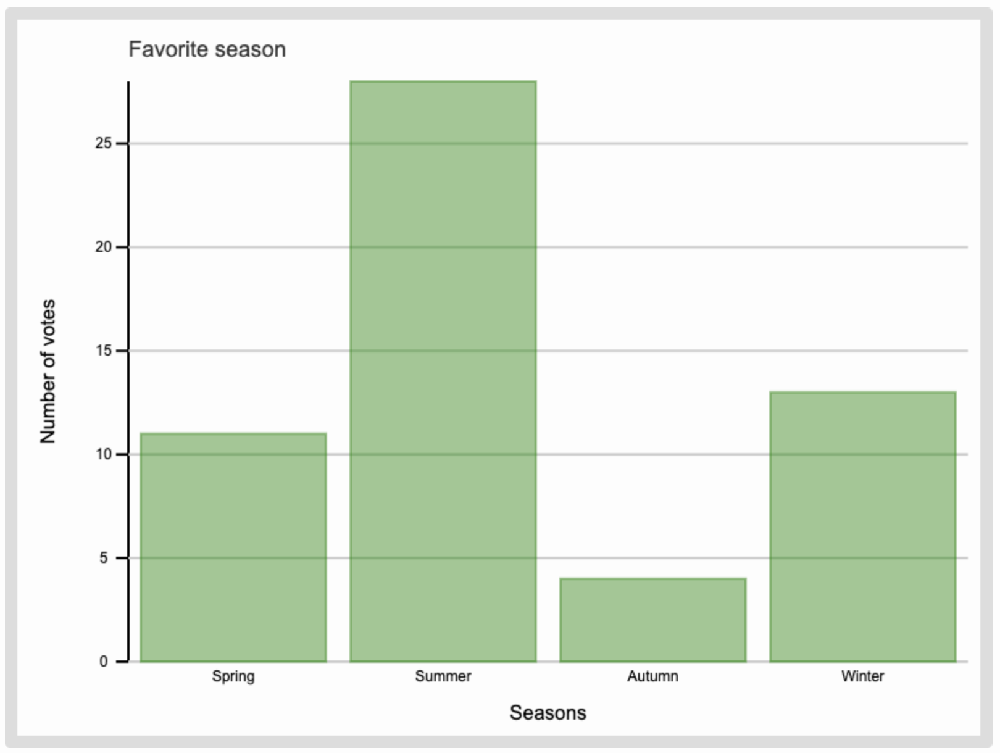

# barcharty
This is a module for creating a customizable bar chart, and part of the course 1DV610 Introduction to Software Quality at LNU.

## 1. Installation Guide
Go the directory where you want to add the module, then clone the repository:
```
git clone https://github.com/miba999/barcharty.git
```

In your JavaScript code, import the module:
```js
import BarChart from './barcharty/BarChart.js'
```
Don't forget to add an HTML canvas element, and give it an id that will be used for creating the bar chart.

## 2. Code Example
Create a canvas HTML element with an id that is used to draw the bar chart. 
```html
<canvas id="canvas"></canvas>
```

Then add some JavaScript to create a bar chart: 
```js
import BarChart from './barcharty/BarChart.js'

const barchart = new BarChart('canvas');
const title = 'Favorite season'
const xLabel = 'Seasons'
const yLabel = 'Number of votes'
const categories = ['Spring', 'Summer', 'Autumn', 'Winter']
const data = [11, 28, 4, 13]
barchart.setHeight(600)
barchart.setWidth(800)
barchart.setTitle(title)
barchart.setXAxisLabel(xLabel)
barchart.setYAxisLabel(yLabel)
barchart.setData(data)
barchart.setCategories(categories)
```

The created barchart would look something like this:


## 3. Documentation: BarChart.js
BarChart is a class for creating bar charts on a HTML canvas element. 

Include the `BarChart.js` file in your project and then create an instance of the `BarChart` class to generate a bar chart.

```js
import BarChart from './barcharty/BarChart.js'

const barchart = new BarChart('canvas');
```

### Constructor
`constructor(id: string) `
Constructor for creating a new bar chart object given the id of the HTML canvas element where the chart will be rendered.

##### Parameters
`id` (string): The id of the canvas element

Example:
```js
const barchart = new BarChart('canvas');
```

### Public Methods

#### `setCategories(xLabels: Array<string>)`
Sets the categories for the x-axis for the bar chart. The number of categories must match the number of data points.

##### Parameters
`xLabels` Array<string>: An array of strings representing the categories for the x-axis

##### Example 
```js
barchart.setCategories(['Spring', 'Summer', 'Autumn', 'Winter'])
```
 
#### `setColor(color: string)`
Sets the color of the bars in the bar chart.

##### Parameters
`color` string: The color of the bars, in format '#RRGGBB' or 'rgba(R, G, B, A)'.

##### Example 
```js
barchart.setColor('#555555')
```
  
#### `setRandomColors()` 
Sets the color of the bars in the bar chart to random colors.

##### Example 
```js
barchart.setRandomColors()
```
 
#### `setData(data: Array<number>)` 
Sets the data for the bar chart. The number of data points must match the number of categories.

##### Parameters
`data` Array<number>: An array of numbers representing the data points for the bar chart.

##### Example 
```js
barchart.setData([11, 28, 4, 13])
```

#### `setHeight(newHeight: number)` 
Sets the height of the canvas element, in pixels.

##### Parameters
`newHeight` number: The new height of the canvas element in pixels

##### Example 
```js
barchart.setHeight(400)
```

#### `setTitle(title: string)` 
Sets the title of the bar chart. The title will be positioned above the bar chart.

##### Parameters
`title` string: The title of the bar chart 

##### Example 
```js
barchart.setTitle('Favorite season')
```

#### `setWidth(newWidth: number) `
Sets the width of the canvas element, in pixels.

##### Parameters
`newWidth` number: The new width of the canvas element in pixels

##### Example 
```js
barchart.setWidth(500)
```
 
#### `setXAxisLabel(label: string)`
Sets the label for the x-axis.

##### Parameters
`label` string: The label for the x-axis

##### Example 
```js
archart.setXAxisLabel('Seasons')
```

#### `setYAxisLabel(label: string)` 
Sets the label for the y-axis.

##### Parameters
`label` string: The label for the y-axis 

##### Example 
```js
barchart.setYAxisLabel('Number of votes')
```


## 4. Bug Reports/Issues
If you find any bugs or have suggestions for improvements, please report them as GitHub issues [here](https://github.com/miba999/barcharty/issues).

## 5. License
Barcharty is licensed under the MIT License. See the LICENSE file for details.